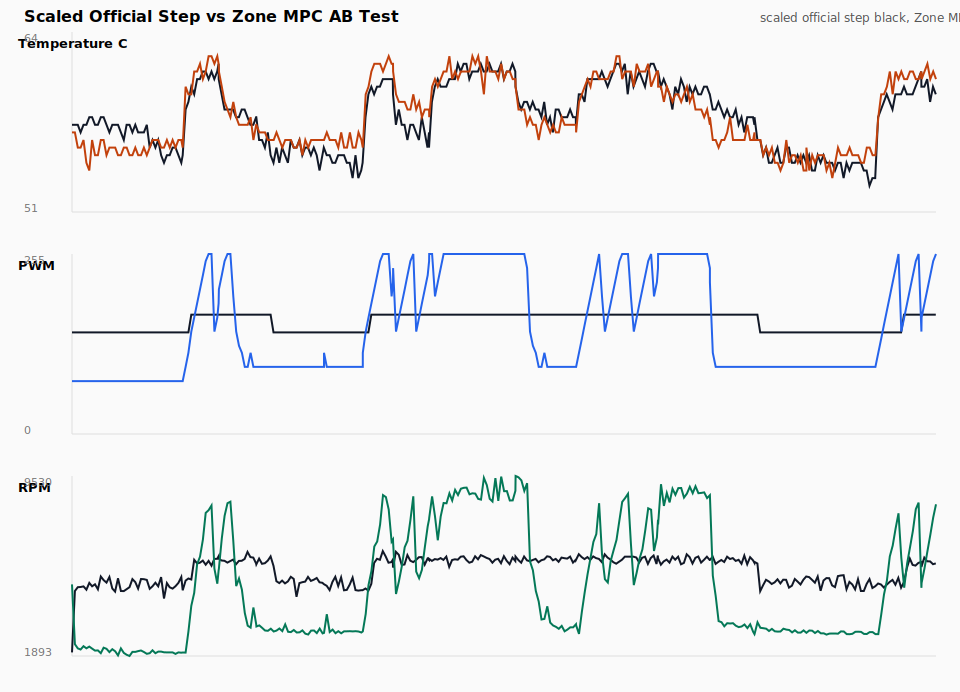
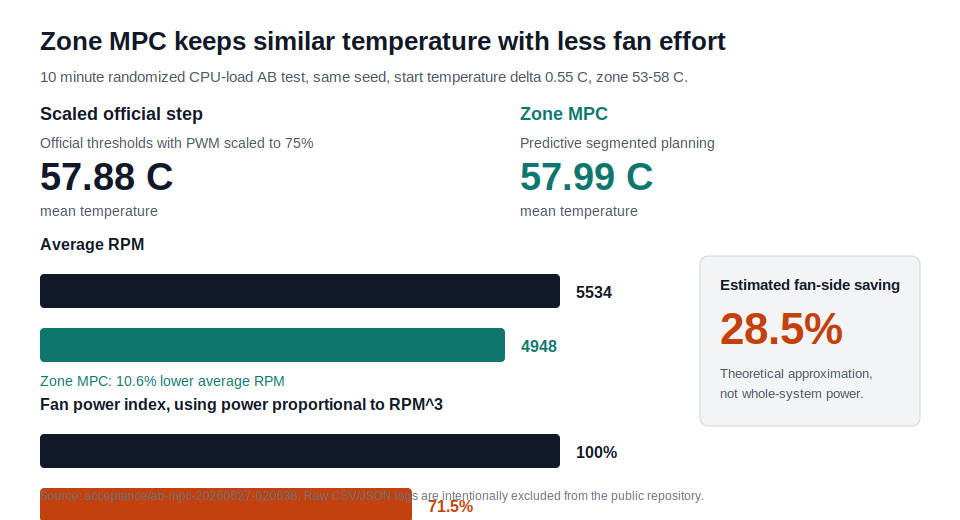

# Raspberry Pi 5 Advanced Fan Controller

[简体中文](README_zh.md) | English

A Raspberry Pi 5 advanced fan controller using Zone MPC.

Instead of waiting for the SoC to cross a few fixed temperature thresholds, this project predicts the near-future thermal trajectory and chooses a PWM that keeps the machine inside a target temperature zone.

The user-visible result is a fan strategy that is more active, cooler, and more controllable:

- The temperature curve is smoother and less likely to overshoot.
- The fan may start earlier, but it does not have to be louder overall.
- The controller uses negligible CPU and memory on the Pi 5.
- Within the temperature target, Zone MPC prefers the lowest PWM cost that still protects the thermal zone.

Implementation standard:

```text
M2 second-order ARX predictor + Zone MPC
```

## Why This Exists

The stock kernel fan policy is simple and robust, but it is reactive: it maps temperature thresholds to fixed PWM steps. That is easy to reason about, but it cannot ask a richer question:

```text
Given current temperature, fan PWM, CPU load, and recent history,
what PWM keeps the next few control steps inside the desired zone
with the least fan effort?
```

This controller answers that question every control interval.

## Quick Install

Clone the project to the expected runtime path:

```bash
cd /home/pi
git clone https://github.com/Zhenyu98/pi-fan-control.git fan-control
cd /home/pi/fan-control
```

Run a no-write dry check first:

```bash
python3 /home/pi/fan-control/fan_control.py --dry-run --duration 20
```

Install and start the service:

```bash
sudo cp /home/pi/fan-control/fan-control.service /etc/systemd/system/fan-control.service
sudo cp /home/pi/fan-control/fan-control-dashboard.service /etc/systemd/system/fan-control-dashboard.service
sudo cp /home/pi/fan-control/fan-control-maintenance.service /etc/systemd/system/fan-control-maintenance.service
sudo cp /home/pi/fan-control/fan-control-maintenance.timer /etc/systemd/system/fan-control-maintenance.timer
sudo systemctl daemon-reload
sudo systemctl enable --now fan-control.service
sudo systemctl enable --now fan-control-dashboard.service
sudo systemctl enable --now fan-control-maintenance.timer
```

Check it:

```bash
systemctl status fan-control.service
systemctl status fan-control-dashboard.service
journalctl -u fan-control.service -n 50 --no-pager
```

Open the read-only dashboard from another device on the LAN:

```text
http://<raspberry-pi-ip>:8766/
```

## Current Product Decision

This project is standardized on **Zone MPC** with a second-order ARX thermal predictor.

The previous single-setpoint controller has been removed from the runtime path. Historical reports may mention earlier experiments, but the supported controller is now the predictive zone controller.

Default policy:

- Target zone: `53-58 C`
- Stable first fan step: `min_active_pwm=75`
- PWM ramp limit: `max_step=20`
- Full speed threshold: `69 C`
- Safety threshold: `70 C`
- Model: `/home/pi/fan-control/data/model_arx2_m2.json`

## How It Works

### M2 ARX Predictor

The active model is a second-order ARX thermal predictor:

```text
T_next =
  a0 * T_now
+ a1 * T_previous
+ b0 * PWM_now
+ b1 * PWM_previous
+ c0 * load_now
+ c1 * load_previous
+ bias
```

Using previous temperature, previous PWM, and previous load makes the model better at short rollout prediction than a simple first-order model. This matters because MPC decisions are based on a horizon, not just one immediate step.

### Zone MPC Controller

Zone MPC evaluates candidate PWM values and rolls the model forward over the prediction horizon.

It prefers:

- temperatures inside the `53-58 C` zone,
- low PWM,
- small PWM changes,
- no sustained predicted violation above `58 C`,
- no predicted approach to the `69 C` full-speed threshold.

It also includes a conservative prediction observer. If the model has recently underpredicted temperature, the controller adds a bounded prediction margin, so future MPC scoring becomes more cautious.

## Measured Result

The current public story is based on a real 10 minute AB run on a Raspberry Pi 5:

- Same randomized CPU-load seed for both arms.
- Start temperature delta: `0.55 C`.
- Target zone: `53-58 C`.
- Baseline: official temperature ladder, with PWM scaled to `75%` so its average temperature is close to Zone MPC.
- Raw CSV/JSON logs are excluded from the repository; the README uses curated figures only.





| Metric | Scaled official step | Zone MPC |
|---|---:|---:|
| Mean temperature | `57.88 C` | `57.99 C` |
| Peak temperature | `61.70 C` | `62.25 C` |
| Seconds above `58 C` | `287.71 s` | `268.76 s` |
| Average PWM | `158.64` | `152.13` |
| Average RPM | `5533.54` | `4948.01` |
| Median RPM | `5816` | `3647` |
| Controller CPU time over 600 s | `0.2351 s` | `0.6536 s` |

Using the common fan affinity approximation `fan power ~= RPM^3`, the AB run estimates:

- Against the temperature-matched scaled official ladder: average fan-side power index dropped from `100%` to about `71.5%`, or roughly `28.5%` theoretical fan-side saving.
- Against the original unscaled official ladder from the comparison run: average RPM was `4715` vs `7219`, giving a theoretical fan-side saving of about `72%`. That comparison is intentionally labeled less fair because the original ladder also ran cooler and louder.

This is not a whole-system wattmeter measurement. It is a fan-side theoretical estimate from measured RPM, useful for comparing control policies with similar thermal targets.

## Core Contribution

This project contributes a practical predictive fan-control path for Raspberry Pi 5 users:

- A controller that plans ahead instead of only reacting after a threshold is crossed.
- A zone target that makes the behavior easier to tune than a single fixed setpoint.
- Conservative prediction margins and high-temperature penalties to avoid systematic undercooling.
- Shadow learning that can improve the model without letting unvalidated models directly control the fan.
- A public, repeatable AB test script for comparing Zone MPC, constant MPC, and official-step policies.
- Evidence that, at a similar thermal target, Zone MPC can reduce fan-side theoretical power by about `28.5%` in the current AB run while keeping controller CPU overhead effectively negligible.

## Files

- `fan_control.py`: live ARX2 Zone MPC controller.
- `fan_control_core.py`: thermal models, ARX2 fitting, prediction observer, Zone MPC.
- `fan_control_shadow.py`: shadow learning and safe model promotion.
- `fan_control_io.py`: sysfs discovery and fan I/O.
- `dashboard_server.py`: read-only HTTP dashboard API and static file server.
- `dashboard.html`: live dashboard for temperature, PWM, RPM, and load.
- `fan_safe.py`: systemd stop-post fallback.
- `collect.py`: data collection.
- `fit_model.py`: ARX2 model fitting from collected samples.
- `identify_model.py`: dedicated load/PWM identification experiment.
- `compare_models.py`: model comparison report generator.
- `evaluate.py`: pressure test and controller overhead measurement.
- `random_stress_test.py`: randomized pressure phases with prediction metrics.
- `fan-control.service`: systemd service template.
- `fan-control-dashboard.service`: read-only dashboard service on port `8766`.
- `fan-control-maintenance.service`: cleanup service for journal and experiment artifacts.
- `fan-control-maintenance.timer`: daily cleanup timer.

The scripts auto-discover the current `/sys/class/hwmon/hwmon*/name == pwmfan` device at startup, so they do not depend on the `hwmonN` number staying fixed across reboots.

## Quick Check

Run without touching PWM:

```bash
python3 /home/pi/fan-control/fan_control.py --dry-run --duration 20
```

Expected log fields include:

```text
mode=zone-mpc
prediction_margin=...
predicted_max=...
terminal=...
violation_steps=...
reason=...
```

## Run Manually

Run the controller for two minutes:

```bash
sudo python3 /home/pi/fan-control/fan_control.py --duration 120
```

The controller restores automatic fan mode on exit.

On this Pi, `pwm1_enable=1` is the effective writable mode. A quick probe showed PWM `40` does not spin the fan, PWM `60` barely spins it, and PWM `75` is the stable first step. The controller therefore avoids tiny non-spinning PWM outputs.

## Shadow Learning

The service runs with `--shadow-learn`.

Shadow learning does not directly control the fan. The active controller keeps using the current stable ARX2 model while the learner records live samples to:

```text
/home/pi/fan-control/data/shadow_samples.csv
```

Every check interval, it fits a candidate model from the rolling sample window. For the current runtime, the candidate is also ARX2. Promotion requires:

- enough samples,
- enough temperature, PWM, and load variation,
- aggregate PWM coefficient remains cooling,
- aggregate load coefficient remains heating,
- ARX temperature memory stays inside conservative bounds,
- high-temperature bias is not systemically underpredicting,
- prediction MAE improves by the configured minimum.

If accepted, the learner atomically writes the current model path and hot-loads the new controller. It keeps only:

```text
current model
previous model
```

The sample log rotates to one `.1` file, so long-running learning data does not grow without bound.

## Logging And Retention

The live controller no longer writes routine journal logs every control interval. By default, `fan_control.py` logs one routine status line every `30` seconds:

```bash
python3 /home/pi/fan-control/fan_control.py --log-interval 30
```

Important events still log immediately:

- PWM changes,
- sustained predicted zone violations,
- full-speed or safety decisions,
- shadow-learning decisions and promotions.

The systemd unit also sets journald rate-limit fields as a backstop:

```text
LogRateLimitIntervalSec=60
LogRateLimitBurst=120
```

Cleanup is handled by `fan_control_maintenance.py`. The default policy keeps recent artifacts and removes older experiment output:

```bash
python3 /home/pi/fan-control/fan_control_maintenance.py --dry-run
sudo python3 /home/pi/fan-control/fan_control_maintenance.py
```

Default retention:

- acceptance artifacts: remove old run directories after `14` days, while keeping the latest `5`,
- evaluation artifacts: remove old `data/evaluation-*.json` files after `14` days, while keeping the latest `5`,
- journal: run `journalctl --vacuum-time=14d --vacuum-size=200M`.

Note: journal vacuum is global to systemd-journald, not per service. The controller reduces its own log volume with `--log-interval`; the vacuum command keeps the journal store bounded.

## Collect And Fit

For a quick local fit from collected samples:

```bash
python3 /home/pi/fan-control/collect.py --duration 600 --interval 2
python3 /home/pi/fan-control/fit_model.py
```

For a better model, use the dedicated identification experiment:

```bash
sudo python3 /home/pi/fan-control/identify_model.py
python3 /home/pi/fan-control/compare_models.py --input /home/pi/fan-control/data/identification/<run>/samples.csv
```

The model selection rule is intentionally conservative:

- do not promote a model only because one-step error is low,
- check rollout error because MPC depends on prediction horizon,
- require cooling sign for PWM,
- require heating sign for load,
- reject high-temperature systematic underprediction.

## Evaluate

Run a short pressure test and overhead measurement:

```bash
sudo python3 /home/pi/fan-control/evaluate.py --duration 90 --workers 4
```

Run randomized pressure phases:

```bash
python3 /home/pi/fan-control/random_stress_test.py --duration 660 --interval 2 --min-phase 20 --max-phase 75 --max-workers 4 --model /home/pi/fan-control/data/model_arx2_m2.json
```

For a no-write check:

```bash
python3 /home/pi/fan-control/evaluate.py --duration 30 --workers 2 --dry-run
```

## Service

Install:

```bash
sudo cp /home/pi/fan-control/fan-control.service /etc/systemd/system/fan-control.service
sudo cp /home/pi/fan-control/fan-control-dashboard.service /etc/systemd/system/fan-control-dashboard.service
sudo cp /home/pi/fan-control/fan-control-maintenance.service /etc/systemd/system/fan-control-maintenance.service
sudo cp /home/pi/fan-control/fan-control-maintenance.timer /etc/systemd/system/fan-control-maintenance.timer
sudo systemctl daemon-reload
sudo systemctl enable --now fan-control.service
sudo systemctl enable --now fan-control-dashboard.service
sudo systemctl enable --now fan-control-maintenance.timer
```

Check:

```bash
systemctl status fan-control.service
systemctl status fan-control-dashboard.service
journalctl -u fan-control.service -n 50 --no-pager
systemctl list-timers fan-control-maintenance.timer
```

Disable the user-space service and set a safe fallback PWM:

```bash
sudo systemctl disable --now fan-control.service
sudo systemctl disable --now fan-control-dashboard.service
sudo systemctl disable --now fan-control-maintenance.timer
sudo python3 /home/pi/fan-control/fan_safe.py
```

## Dashboard

The optional dashboard is a read-only HTTP view of local controller data:

```bash
sudo systemctl enable --now fan-control-dashboard.service
curl http://127.0.0.1:8766/api/status
```

Open it from the LAN:

```text
http://<raspberry-pi-ip>:8766/
```

Endpoints:

- `/`: live dashboard HTML.
- `/api/status`: latest sample, service state, configured target zone.
- `/api/latest?minutes=60&max_points=1800`: recent samples for plotting.
- `/api/summary?hours=4`: aggregate temperature, PWM, RPM, load, and zone metrics.

The dashboard reads `data/shadow_samples.csv`, supports `HEAD` health checks, and never writes PWM.

## Kernel Fan Policy

The current `/boot/firmware/config.txt` does not contain active custom `dtparam=fan_temp*` or `dtparam=cooling_fan` lines.

While `fan-control.service` is running, the user-space controller owns PWM. If the service stops, `ExecStopPost` runs `fan_safe.py`, which sets a safe PWM based on current temperature.

If custom `fan_temp*` entries are added later, treat them as a fallback policy rather than the primary controller.

## Safety And Privacy

- The controller auto-discovers the Raspberry Pi fan `hwmon` device instead of depending on a fixed `hwmonN` path.
- `fan_safe.py` is used as a systemd stop-post fallback so service shutdown does not leave the fan in a risky state.
- `safety_temp` forces full-speed cooling before the SoC reaches a dangerous range.
- Shadow learning records local thermal samples only and does not upload data.
- Raw logs, samples, and experiment outputs are ignored by git and are not part of the public release.

## FAQ

**Will it be quieter than the default kernel fan policy?**

Usually the fan starts earlier, but Zone MPC tries to use the lowest PWM that still keeps the temperature inside the target zone. The result should be smoother temperature control rather than simply louder fan behavior.

**Does online learning directly control the fan?**

No. Shadow learning can propose a better model only after safety checks. The active controller keeps using the current validated model until a candidate passes conservative promotion rules.

**Can I keep `dtparam=fan_temp*` in `config.txt`?**

Treat those entries as fallback policy. While `fan-control.service` is running, user-space owns PWM. If the service stops, the fallback and `fan_safe.py` protect the machine.

**Does this need network access?**

No runtime network access is required.

## Roadmap

- Broaden identification data across more ambient temperatures and cases.
- Add optional RPM-aware model validation for boards where RPM readings are reliable.
- Provide a packaged installer that can migrate from the current manual systemd copy flow.
- Add a concise dashboard or text UI for live temperature, PWM, RPM, and prediction margin.

## License

This project is released under the MIT License. See [LICENSE](LICENSE).

## Acknowledgements

- [Raspberry Pi documentation](https://www.raspberrypi.com/documentation/) for platform and configuration references.
- [systemd](https://systemd.io/) for service supervision and journal integration.
- [stress-ng](https://github.com/ColinIanKing/stress-ng) for stress-test workloads used during validation.
