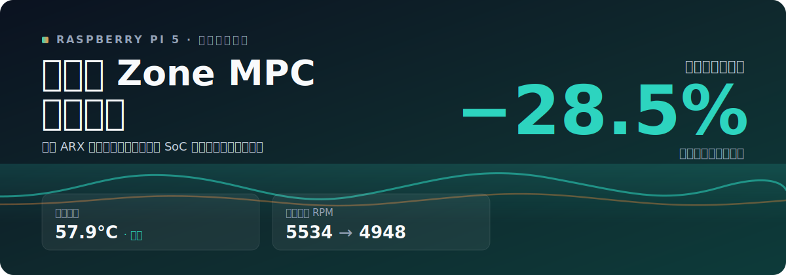

# Raspberry Pi 5 高级风扇控制器

[English](README.md) | 简体中文

<p align="center">
  
</p>

一个用于 Raspberry Pi 5 官方风扇的高级温控服务，使用 Zone MPC 让风扇策略更主动、更低温、更可控。

它不是等温度越过几个固定阈值后再分段调速，而是根据当前温度、PWM、负载和短期历史预测接下来的温度轨迹，然后选择一个尽量低的 PWM，把机器维持在目标温度区间内。

你会得到的效果：

- 温度曲线更平滑，不容易冲高。
- 风扇可能更早启动，但不一定更吵。
- 控制脚本资源占用几乎无感。
- 在满足控温目标的前提下，Zone MPC 会倾向使用更低的风扇输出。

当前默认策略：

- 目标温度区间：`53-58 C`
- 稳定起转 PWM：`min_active_pwm=75`
- 单次 PWM 最大变化：`max_step=20`
- 满速阈值：`69 C`
- 安全阈值：`70 C`
- 模型文件：`/home/pi/fan-control/data/model_arx2_m2.json`
- 可选只读仪表盘：`http://<raspberry-pi-ip>:8766/`

## 为什么做这个

树莓派默认的内核风扇策略很稳，但它是被动的：温度到某个阈值，就切到一个固定 PWM 档位。这种策略简单可靠，但不知道“接下来温度会怎么走”。

这个项目每个控制周期都会问一个更接近真实需求的问题：

```text
在当前温度、风扇 PWM、CPU 负载和短期历史下，
未来几个控制周期内用多大 PWM，
能把温度维持在目标区间里，同时尽量少用风扇？
```

这就是 Zone MPC 的作用。

## 实测结果

当前公开展示使用一组 Raspberry Pi 5 上的真实 10 分钟 AB 测试：

- 两组使用同一个随机 CPU 负载 seed；
- 初始温度差：`0.55 C`；
- 目标温度区间：`53-58 C`；
- 对照组：官方阶梯策略，并把 PWM 整体缩放到 `75%`，让平均温度尽量接近 Zone MPC；
- 原始 CSV/JSON 日志不进入仓库，README 只保留精选图表。


| 指标 | 官方阶梯 75% PWM | Zone MPC |
|---|---:|---:|
| 平均温度 | `57.88 C` | `57.99 C` |
| 峰值温度 | `61.70 C` | `62.25 C` |
| 高于 `58 C` 的时间 | `287.71 s` | `268.76 s` |
| 平均 PWM | `158.64` | `152.13` |
| 平均 RPM | `5533.54` | `4948.01` |
| 中位 RPM | `5816` | `3647` |
| 600 秒控制器 CPU 时间 | `0.2351 s` | `0.6536 s` |

按照风扇常见近似 `风扇功耗 ~= RPM^3` 估算：

- 与平均温度接近的官方 75% PWM 阶梯相比，Zone MPC 的平均风扇侧功耗指数约从 `100%` 降到 `71.5%`，理论风扇侧节省约 `28.5%`。
- 与未缩放的原始官方阶梯相比，Zone MPC 平均 RPM 是 `4715` vs `7219`，理论风扇侧节省约 `72%`。这个对比不如上面的 75% 阶梯公平，因为原始官方阶梯更冷，但也明显更高转。

这不是整机功耗电表结果，而是基于实测 RPM 的风扇侧理论估算。它适合用来比较温控策略是否在类似温度目标下减少了风扇输出。

## 快速安装

建议安装到固定路径 `/home/pi/fan-control`，因为 systemd service 默认使用这个路径：

```bash
cd /home/pi
git clone https://github.com/Zhenyu98/pi-fan-control.git fan-control
cd /home/pi/fan-control
```

先运行不写 PWM 的 dry-run：

```bash
python3 /home/pi/fan-control/src/fan_control.py --dry-run --duration 20
```

确认能识别温度和风扇路径后，再安装服务：

```bash
sudo cp /home/pi/fan-control/fan-control.service /etc/systemd/system/fan-control.service
sudo cp /home/pi/fan-control/fan-control-dashboard.service /etc/systemd/system/fan-control-dashboard.service
sudo cp /home/pi/fan-control/fan-control-maintenance.service /etc/systemd/system/fan-control-maintenance.service
sudo cp /home/pi/fan-control/fan-control-maintenance.timer /etc/systemd/system/fan-control-maintenance.timer
sudo systemctl daemon-reload
sudo systemctl enable --now fan-control.service
sudo systemctl enable --now fan-control-dashboard.service
sudo systemctl enable --now fan-control-maintenance.timer
```

查看状态：

```bash
systemctl status fan-control.service
systemctl status fan-control-dashboard.service
journalctl -u fan-control.service -n 50 --no-pager
systemctl list-timers fan-control-maintenance.timer
```

局域网访问只读仪表盘：

```text
http://<raspberry-pi-ip>:8766/
```

如果要停用用户态服务，并设置一个安全兜底 PWM：

```bash
sudo systemctl disable --now fan-control.service
sudo systemctl disable --now fan-control-dashboard.service
sudo systemctl disable --now fan-control-maintenance.timer
sudo python3 /home/pi/fan-control/src/fan_safe.py
```

## 工作原理

### Zone MPC

Zone MPC 不追求把温度死死控制在某一个点，而是控制在一个区间里。默认目标是 `53-58 C`。

控制器会枚举一组候选 PWM，预测未来几个周期的温度轨迹，然后给每个候选方案打分。它更喜欢：

- 温度留在 `53-58 C`；
- PWM 尽量低；
- PWM 变化不要太剧烈；
- 不出现持续超过 `58 C` 的预测；
- 不接近 `69 C` 满速阈值和 `70 C` 安全阈值。

所以它可能比默认策略更早让风扇动起来，但不是为了“更吵”，而是为了避免温度先冲上去再补救。

### 温度预测模型

当前实现使用二阶 ARX 热模型，也就是用当前和上一周期的温度、PWM、负载来预测下一步温度：

```text
T_next =
  a0 * T_now
+ a1 * T_previous
+ b0 * PWM_now
+ b1 * PWM_previous
+ c0 * load_now
+ c1 * load_previous
+ bias
```

这比只看当前温度和负载的一阶模型更适合短期 rollout，因为 MPC 决策依赖未来几步的预测，而不只是下一秒。

控制器还带有保守预测观察器：如果最近模型低估温度，它会加入最多 `3 C` 的预测裕度，让 MPC 更谨慎。

## 项目贡献

这个项目给 Raspberry Pi 5 用户提供了一条实用的预测式风扇控制路径：

- 风扇不再只是温度越过阈值后被动反应，而是根据未来温度轨迹提前规划。
- 目标是一个温度区间，而不是一个固定点，因此更容易调成自己想要的“温度/噪声”平衡。
- 通过预测裕度和高温持续越界惩罚，降低模型低估温度导致冲高的风险。
- 旁路学习会在后台持续采集数据、更新候选模型，但未经验证的模型绝不会直接接管风扇。
- 提供可复现的实机 AB 测试脚本，方便对比 Zone MPC、constant MPC 和官方阶梯策略。
- 在当前温度目标接近的 AB 测试中，Zone MPC 的风扇侧理论功耗约节省 `28.5%`，同时控制脚本资源占用几乎无感。

## 文件说明

仓库按「运行必需」和「离线工具」分成两层：服务真正依赖的运行时放在 `src/`，建模和benchmark用的研发脚本放在 `tools/`。

`src/` —— 运行时（`fan-control.service` 实际跑的就是这些）：

- `fan_control.py`：实时 Zone MPC 风扇控制服务入口。
- `fan_control_core.py`：热模型、预测观察器、Zone MPC 逻辑。
- `fan_control_shadow.py`：旁路学习与模型的安全升级。
- `fan_control_io.py`：sysfs 风扇路径发现和 I/O。
- `dashboard_server.py`：只读 HTTP 仪表盘 API 和静态文件服务。
- `dashboard.html`：显示温度、PWM、RPM、负载的实时仪表盘。
- `fan_safe.py`：systemd 停止后的安全兜底。
- `fan_control_maintenance.py`：日志和实验产物清理逻辑。

`tools/` —— 离线研发工具（运行服务用不到）：

- `collect.py`：采集温度、PWM、负载和 RPM。
- `fit_model.py`：从采样数据拟合模型。
- `identify_model.py`：专门的负载/PWM 辨识实验。
- `model_identification.py`：辨识实验调度和模型对比的公共库。
- `compare_models.py`：模型对比报告。
- `evaluate.py`：压力测试和控制脚本资源占用评估。
- `random_stress_test.py`：随机压力阶段测试。
- `ab_mpc_test.py`：在同一负载随机种子下并行跑 Zone MPC、constant MPC 和官方缩放阶梯，并生成对比图表的 AB 测试脚本。

`tools/` 里每个脚本会先 `import _pathfix`，这样直接运行时能找到 `src/` 里的运行时模块。

项目根目录 —— 服务单元和测试：

- `fan-control.service`：主 systemd 服务模板。
- `fan-control-dashboard.service`：监听 `8766` 端口的只读仪表盘服务。
- `fan-control-maintenance.service`：日志和实验产物清理服务。
- `fan-control-maintenance.timer`：每日清理定时器。
- `tests/`：单元测试（`python3 -m pytest`）；`conftest.py` 会把 `src/` 和 `tools/` 加入导入路径。

脚本启动时会自动扫描 `/sys/class/hwmon/hwmon*/name == pwmfan`，不依赖固定 `hwmonN` 编号。

## 旁路学习（shadow learning）

服务默认开启 `--shadow-learn`。

旁路学习不会直接控制风扇：实时控制器始终使用当前的稳定模型，学习过程只在后台把本地样本记录到：

```text
/home/pi/fan-control/data/shadow_samples.csv
```

后台会用滚动窗口拟合候选模型。只有同时满足以下条件，才可能替换当前模型：

- 样本足够；
- 温度、PWM、负载变化足够；
- PWM 系数整体表示“散热”；
- load 系数整体表示“升温”；
- 高温段不能系统性低估；
- 预测误差改善达到阈值。

样本日志会轮转，只保留当前文件和一个 `.1` 文件，避免长期运行无限增长。

## 日志和清理

主服务默认每 `30` 秒输出一次常规状态日志：

```bash
python3 /home/pi/fan-control/src/fan_control.py --log-interval 30
```

重要事件仍然会立即记录：

- PWM 变化；
- 预测持续越界；
- 满速或安全策略触发；
- 旁路学习的候选模型被采纳或被拒绝。

清理工具：

```bash
python3 /home/pi/fan-control/src/fan_control_maintenance.py --dry-run
sudo python3 /home/pi/fan-control/src/fan_control_maintenance.py
```

默认策略：

- acceptance 运行目录保留最近 `14` 天，并至少保留最新 `5` 个；
- `data/evaluation-*.json` 保留最近 `14` 天，并至少保留最新 `5` 个；
- journal 执行 `journalctl --vacuum-time=14d --vacuum-size=200M`。

注意：journal vacuum 是 systemd-journald 的全局清理，不是只清这个服务。

## 只读仪表盘

仪表盘从 `data/shadow_samples.csv` 读取实时数据，不提供任何 PWM 写接口：

```bash
sudo systemctl enable --now fan-control-dashboard.service
curl http://127.0.0.1:8766/api/status
```

局域网访问：

```text
http://<raspberry-pi-ip>:8766/
```

接口：

- `/`：实时 HTML 仪表盘。
- `/api/status`：最新采样、服务状态、目标温度区间。
- `/api/latest?minutes=60&max_points=1800`：绘图用最近采样。
- `/api/summary?hours=4`：温度、PWM、RPM、负载和目标区间统计。

服务支持 `HEAD` 健康检查，不会影响主风扇控制服务。

## 安全和隐私

- 控制器自动发现风扇 hwmon 路径，避免重启后 `hwmonN` 变化导致写错路径。
- `fan_safe.py` 作为 systemd `ExecStopPost` 兜底，避免服务退出后风扇停在危险状态。
- `safety_temp` 会在高温时强制满速。
- 旁路学习只记录本机热数据，不上传网络。
- 原始样本、日志、运行产物和缓存都已被 `.gitignore` 排除，不属于公开发布范围。

## 常见问题

**它一定更安静吗？**

不保证。它的目标是更主动、更平滑、更可控。风扇可能更早启动，但 Zone MPC 会在满足温度目标的前提下尽量降低 PWM，不是简单满速压温度。

**旁路学习会不会突然换上一个坏模型来控制风扇？**

不会。在线学习全程处于旁路模式，候选模型必须通过样本量、系数方向、高温段误差、预测精度提升等多项检查，才会被采纳。

**还能用 `dtparam=fan_temp*` 吗？**

可以把它当 fallback。`fan-control.service` 运行时由用户态控制 PWM；服务停止时，`fan_safe.py` 和内核策略负责兜底。

**运行时需要联网吗？**

不需要。控制器只读写本机温度、负载、PWM 和 RPM。

## Roadmap

- 在更多环境温度和负载组合下采集辨识数据。
- 增加可选 RPM-aware 模型验证。
- 提供一键安装脚本，减少手动复制 systemd 文件。
- 增加轻量命令行或文本 UI，显示温度、PWM、RPM、预测裕度和当前原因。

## Agent 安装

如果你希望让 Codex、ChatGPT、Claude Code、Cursor 等智能体辅助安装，请先让它阅读：

```text
agent-setup.md
```

这个文件要求智能体先做 dry-run 和 smoke test，涉及系统目录、PWM/sysfs、服务启停、压力测试时必须先征求用户批准。

## License

本项目使用 MIT License，见 [LICENSE](LICENSE)。

## Acknowledgements

- [Raspberry Pi documentation](https://www.raspberrypi.com/documentation/)：平台和配置参考。
- [systemd](https://systemd.io/)：服务管理和 journal。
- [stress-ng](https://github.com/ColinIanKing/stress-ng)：验收测试中的压力负载工具。
